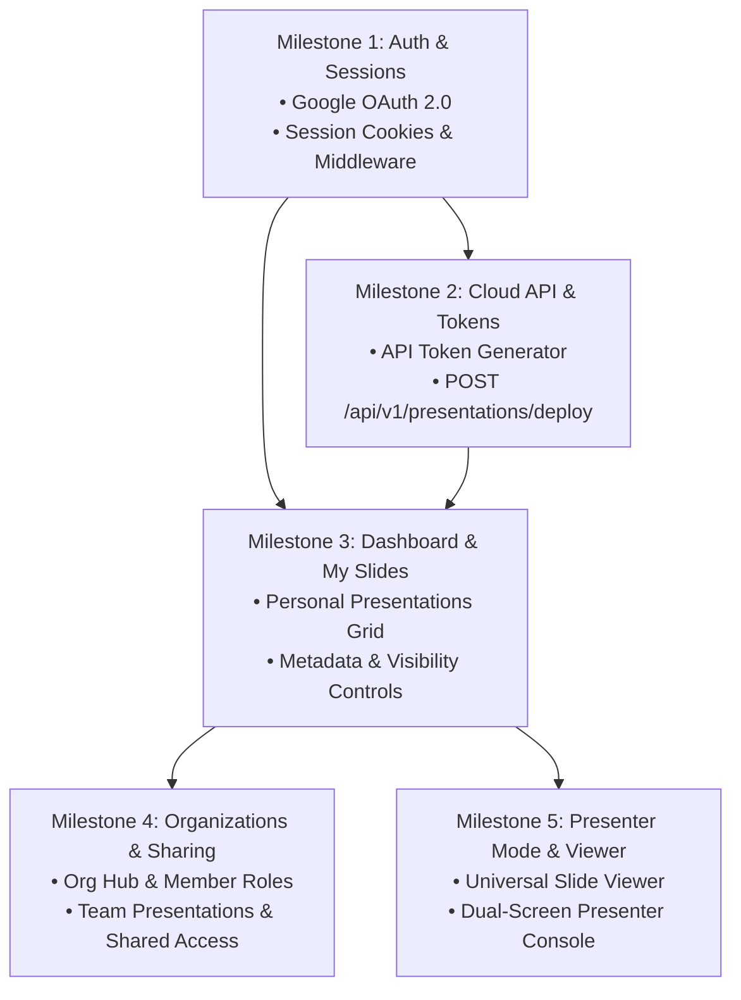

# UNSA Slides - Implementation Roadmap

This document outlines the architectural milestones and implementation plan for transforming UNSA Slides into a Cloud Slides Management platform with CLI slide authoring.

---

## Architecture Overview

---

## Milestones & Specifications

### 🔐 Milestone 1: Google OAuth & Session Management
- **Google OAuth 2.0 Integration**:
  - `GET /api/auth/google`: Initiates OAuth authorization flow with Google.
  - `GET /api/auth/callback`: Handles Google redirect, creates/updates user in database (`users` table), and issues session token.
  - `POST /api/auth/logout`: Clears session cookie and invalidates session.
- **Session Layer & Auth Context**:
  - HTTP-only, secure, `SameSite=Lax` session cookie (`unsa_session`).
  - Auth helper in `apps/web/src/lib/auth.ts` to validate sessions on server routes and inject user context into TanStack Start loaders.
- **Login & Landing Page**:
  - `/login`: Clean, branded login page with "Sign in with Google" button.
  - `/`: Landing page highlighting platform features, CLI ecosystem, and dashboard access.

---

### 🔌 Milestone 2: Cloud Ingestion API & CLI Bridge
- **CLI API Tokens**:
  - `api_tokens` table in `@unsa-slides/db` for persistent developer authentication.
  - Settings page `/dashboard/settings/tokens` for generating, naming, and revoking API keys.
- **Slide Ingestion Endpoint**:
  - `POST /api/v1/presentations/deploy`:
    - Validates Bearer API token or session cookie.
    - Validates slide manifest against `@unsa-slides/schemas/manifest`.
    - Inserts a new `presentation_versions` record and increments `active_version`.
    - Stores slide bundle and assets.
- **Device Code Flow**:
  - `POST /api/v1/auth/device-code`: Generates device login code for `slides login`.
  - `POST /api/v1/auth/device-exchange`: Exchanges verified device code for an API token.

---

### 📊 Milestone 3: User Dashboard & "My Slides"
- **Authenticated Dashboard Shell (`/dashboard`)**:
  - Navigation sidebar with active workspace indicator, personal slides, organizations, and settings.
  - User profile drawer with logout button.
- **Personal Presentations Grid**:
  - Display all user presentations with active version badge, visibility tag (`private`, `unlisted`, `public`), and last deployed timestamp.
  - Slide action menu:
    - **Launch Presentation** (`/p/:slug`).
    - **Open Presenter Console** (`/p/:slug/present`).
    - **CLI Instructions Drawer**: Displays `slides link` and `slides deploy` command snippets.
    - **Edit Metadata Modal**: Update title, description, and visibility.
    - **Delete Presentation**: Cascade delete presentation and associated versions.

---

### 🏢 Milestone 4: Organizations & Team Sharing
- **Organization Creation & Settings**:
  - `/dashboard/orgs/new`: Create organization with name and slug.
  - `/dashboard/orgs/$orgSlug/settings`: Edit organization details and manage org-scoped deploy tokens.
- **Organization Hub (`/dashboard/orgs/$orgSlug`)**:
  - View all presentations created under the organization.
  - Create new organization presentation slot.
- **Member Management (`/dashboard/orgs/$orgSlug/members`)**:
  - List organization members with role badges (`owner`, `admin`, `member`, `viewer`).
  - Invite new members by email.
  - Role promotion/demotion and member removal.

---

### 🎭 Milestone 5: Universal Slide Viewer & Presenter Mode
- **Audience Viewer (`/p/$slug` & `/p/$orgSlug/$slug`)**:
  - Distraction-free, responsive fullscreen slide renderer powered by Reveal.js.
  - Access control verification (verifies public, unlisted, org membership, or owner permission).
  - Keyboard shortcuts (arrows, space, F for fullscreen, overview mode).
- **Dual-Screen Presenter Console (`/p/$slug/present`)**:
  - Current slide view + upcoming next slide preview.
  - Live speaker notes parser.
  - Wall clock, elapsed presentation timer, and slide index counter.
  - Synchronized navigation across windows via `BroadcastChannel` (controlling the presenter console advances the audience window in real time).

---

## Technical Standards

- **No Barrel Files**: Export submodules directly via `package.json` `exports` map.
- **Path Aliases**:
  - Intra-package imports use `@/*` alias.
  - Cross-package imports use package name alias (`@unsa-slides/schemas/...`, `@unsa-slides/db/...`).
- **Runtime & Tools**: Bun runtime APIs, TanStack Start, React 19, Tailwind CSS v4, Biome, Drizzle ORM.
